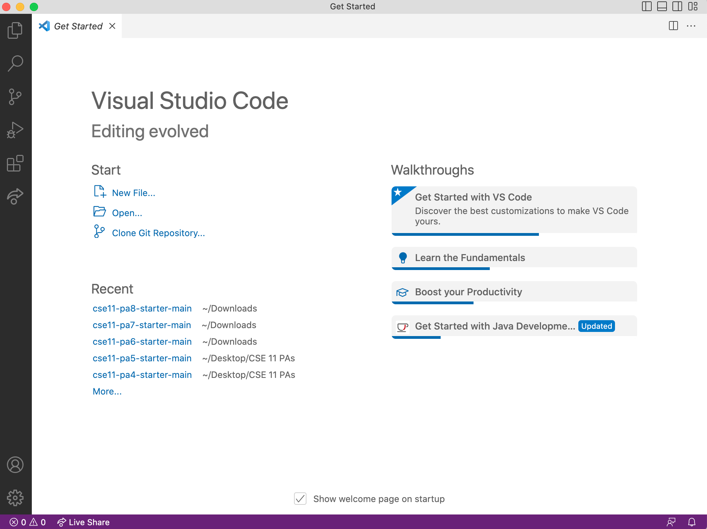

# Lab Report 1 
I will be demonstrating three steps to set up your computer/laptop environment to complete the tasks in CSE 15L. There are three parts:
- Installing VScode
- Remotely Connecting
- Trying Some Commands

## Installing VScode:
I did not perform this step because I have VScode downloaded in my laptop already. 
The VScode should show up like this: 

## Remotely Connecting(for Mac users):
**Step 1**: open a new terminal in VScode by clicking on "terminal" on the upper left corner of the screen

**Step 2**: after opening a new terminal, type in `ssh cs15lsp23zz@ieng6.ucsd.edu` where the `zz` is replaced by your UCSD student account user name
_ I am demostrating with my regualr account here, because the cs15l account is not working for me at this point_

