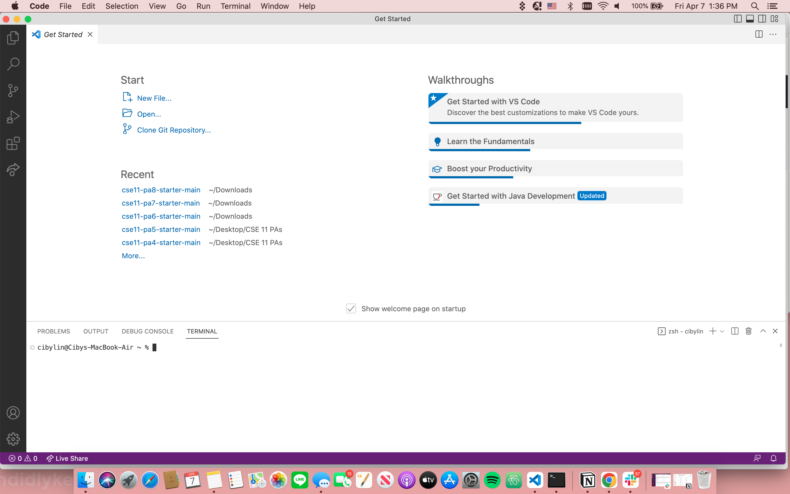
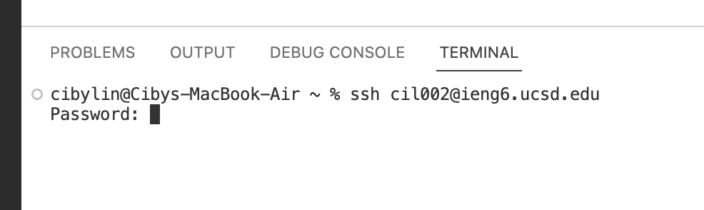
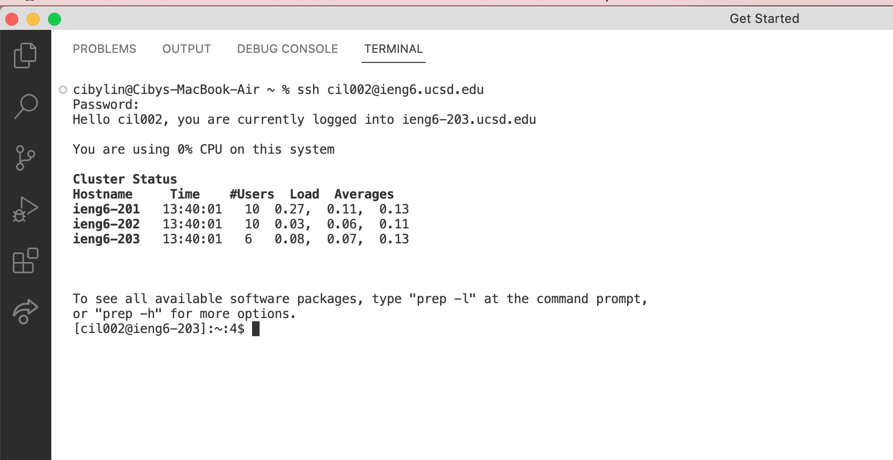
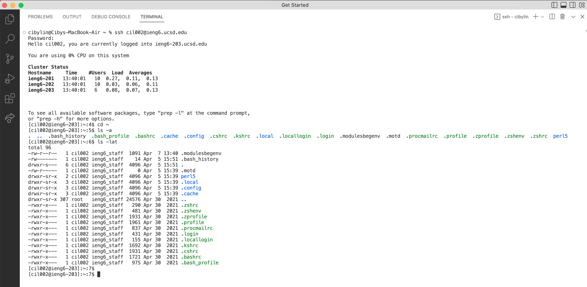

# Lab Report 1 
I will be demonstrating three steps to set up your computer/laptop environment to complete the tasks in CSE 15L. There are three parts:
- Installing VScode
- Remotely Connecting
- Trying Some Commands

## Installing VScode:
I did not perform this step because I have VScode downloaded in my laptop already. 
The VScode should look like this: 

## Remotely Connecting(for Mac users):
**Step 1**: Open a new terminal in VScode by clicking on "terminal" on the upper left corner of the screen

**Step 2**: After the "%" sign, type in `ssh cs15lsp23zz@ieng6.ucsd.edu` where the `zz` is replaced by your UCSD student account user name. (read **Step 4** before proceeding if connecting for the first time).
The system will prompt you to enter your password. (It is normal to not see anything when you type, so type carefully)
_ I am demostrating with my regualr account here, because the cs15l account is not working for me at this point_

**Step 3**: If this is your first time connecting to the server you would see the prompt after the `ssh` commnad and after typing in your password:

`The authenticity of host 'ieng6.ucsd.edu (128.54.70.227)' can't be established.
RSA key fingerprint is SHA256:ksruYwhnYH+sySHnHAtLUHngrPEyZTDl/1x99wUQcec.
Are you sure you want to continue connecting (yes/no/[fingerprint])? `

In this case, you would want to type in "yes" and press enter.
**Step 4**: The system would run and print out the following message

This means you have successfully connected to the server and you can now run commands on this computer!

## Trying Commands:
After remotely connected to the server. You can now try some common commands:
I am trying `ls -lat` and `ls -a` commands here

These two commands shoulds show you all the files 

