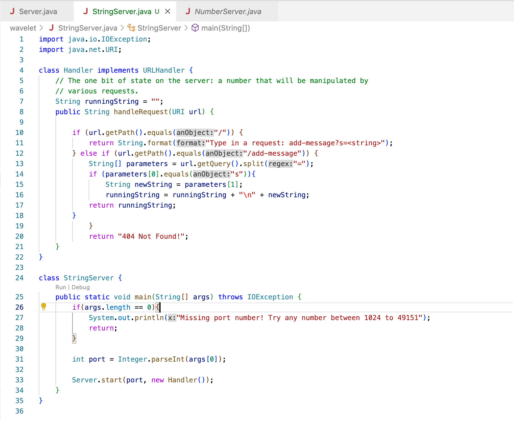
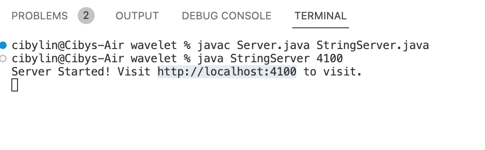
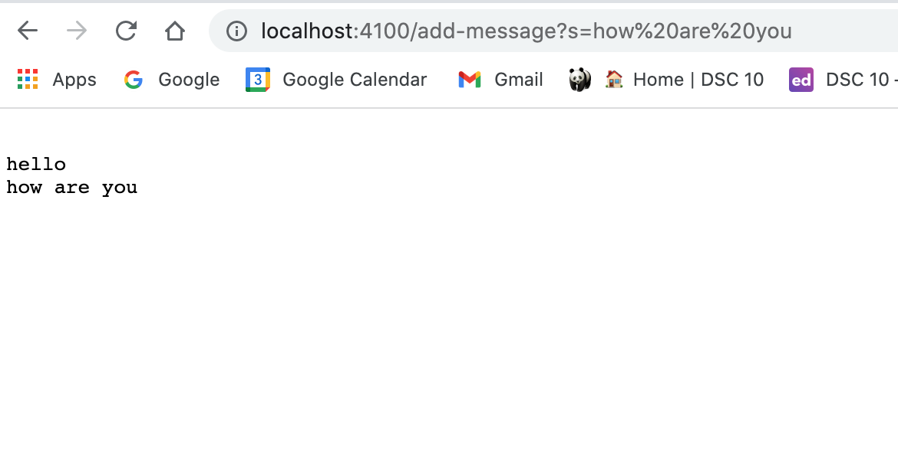
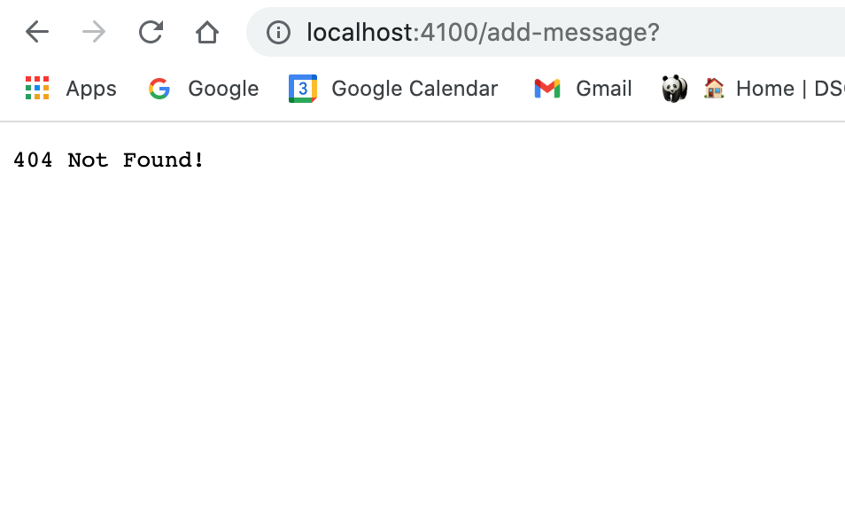
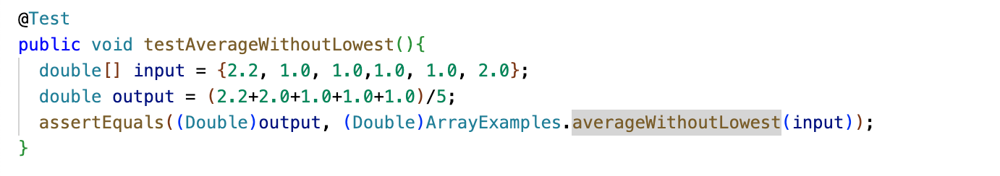
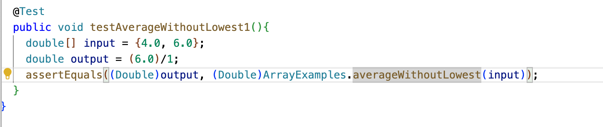
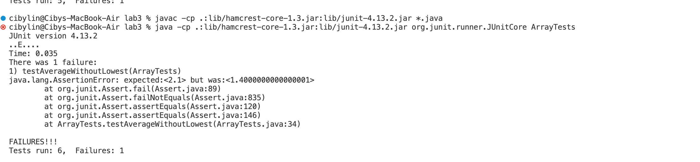
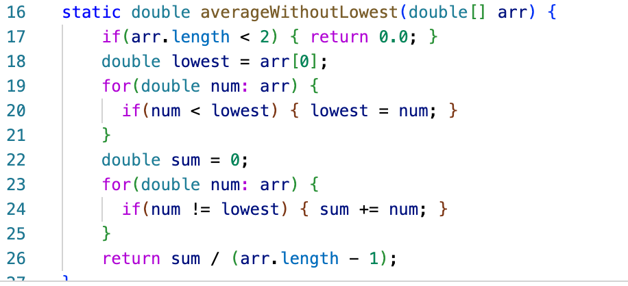

# Lab Report 2

## Part I 
This code creates a web server `StringServer` that takes the command in format `/add-message?s=<string>` then concatenate a new line and a string after `=` to the running string and returns the whole string:

Here are the commands called to compile and run the server:

Two screen shots using `/add-message`:

This view of the web server is created by first using `s=hello` then switch it out for `s=how are you` queries.
The methods called are`.getPath()` , `getQuery`, `handleRequest`, `.split`,and `.equals`in this case.
The relevant arguements to those methods are `url` for both `getPath` and `getQuery`, `URI url` for the  `handleRequest` method, `=` (a character to split the string by) for the `.split` method, and last but not least `/add-message`, which is the input of the path as a string we needed to proceed with the output. The values of `URI url` changed from `\add-message?s=hello` to `\add-message?s=how are you` when calling the command to create this output. The runnignString field changed from `hello` to `"hello" + "\n" + "how are you"`.

When there is not a query message in the URI,  only the `handleRequest` method is called and the rest of the method was skipped through to get to the bottom line to return `404 not found!`. The relevant field `runningString` did no change from this request because the methods were not run to modify the field. 

## Part II

I choose the `averageWithoutLowest` as the bug I will be explaing. 

Here is failure induced input I applied to the test:

Here is the input that does not induce an error:

Here are the symptoms:

This is the before:

This is the after bug fix:

Before fixing the bug, the method fitlered out all the lowest values when there is more than one duplicates of the lowest value in the input array. We fix the bug by summing up all the values from the array and only took out one of the lowest value using the `sum-=lowest` command. As you can see from the symptoms from the failure-induced input, the expected value is larger than the actual value. 

## Part III
From week 2 lab I learned how to workign with server remotely and open up a server using the `-curl` command. This is especially helpful, because this allows the programmer to access the server without working browser. From week 3, I learned how to wrtie a JUnit test and create failure-inducing inputs. I did not know the importance of inducing the failure from your test, since I'va always thought the code is good enough as long as I got the program to work form a few commands.
