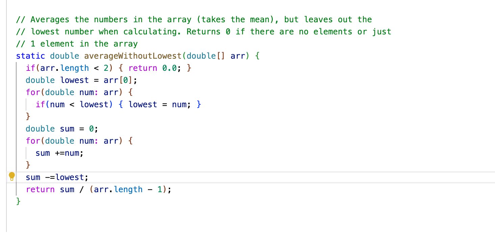

# Lab Report 2

## Part I 
Here is the code that builds a web server that contains a list of strings as the string in the query of the link changed:

Here are the commands called to compile and run the server:

Two screen shots using `/add-message`:

For the `s=hello` query, these methods from the code were called: `.getPath()` , `getQuery`, `handleRequest`, `.split`,and `.equals`.
The relevant arguements to those methods are `url` for both `getPath` and `getQuery`, `URI url` for the  `handleRequest` method, `=` (a character to split the string by) for the `.split` method, and last but not least `/add-message`, which is the input of the path as a string we needed to proceed with the output. The values of `URI url` changed from `\add-message?s=hello` to `\add-message?s=how are you` when calling the command to create this output.

Which methods in your code are called?
What are the relevant arguments to those methods, and the values of any relevant fields of the class?
How do the values of any relevant fields of the class change from this specific request? If no values got changed, explain why.
By values, we mean specific Strings, ints, URIs, and so on. "abc" is a value, 456 is a value, new URI("http://...") is a value, and so on.)

## Part II

I choose the `averageWithoutLowest` as the bug I will be explaing. 

Here is failure induced input I applied to the test:

Here is the input that does not induce an error:

Here are the symptoms:

This is the before:

This is the after bug fix:

Before fixing the bug, the method fitlered out all the lowest values when there is more than one duplicates of the lowest value in the input array. We fix the bug by summing up all the values from the array and only took out one of the lowest value using the `sum-=lowest` command. As you can see from the symptoms from the failure-induced input, the expected value is larger than the actual value. 

## Part III
From week 2 lab I learned how to workign with server remotely and open up a server using the `-curl` command. This is especially helpful, because this allows the programmer to access the server without working browser. From week 3, I learned how to wrtie a JUnit test and create failure-inducing inputs. I did not know the importance of inducing the failure from your test, since I'va always thought the code is good enough as long as I got the program to work form a few commands.
