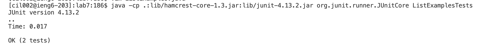
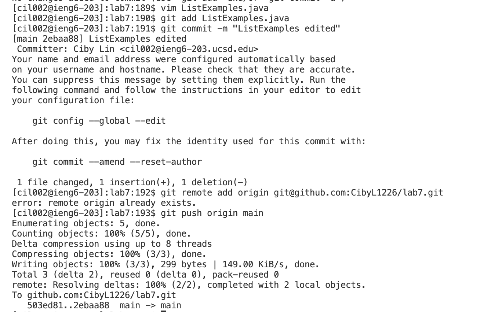

# Lab Report 4
In this lab report I am going to demonstrate and show the keys I pressed to make changes and update it to its Github repository all by commands in the terminal
## Step 4

**key pressed:** after typing in the command `ssh cil002@ieng6.ucsd.edu` to log into my ieng6 machine I pressed `<return>` to ran it. 

## Step 5

**key pressed:** Then I typed `git clone` and `<tab>` follow by `git@github.com:CibyL1226/lab7.git` I copied and pasted using `<ctrl + c> <ctrl + v>`, and I ran it using `<return>`. After I cloned it, I used `ls` to make sure it was cloned to the repository. Then I used `<down><down>` to move the cursor down for the new command.
  

  
## Step 6

**key pressed:** I typed in `cd ~/lab7` command to access the lab7 directory to run the tests. I pressed `<return>` then `ls + <return>` to check if I am in the right directory. `<down><down>` and `javac -cp .:lib/hamcrest-core-1.3.jar:lib/junit-4.13.2.jar *.java` to compile the test file and `java -cp .:lib/hamcrest-core-1.3.jar:lib/junit-4.13.2.jar org.junit.runner.JUnitCore ListExamplesTests.java` to run the test. `<return>`
  

## Step 7

**key pressed:** I access the `ListExample.java` using `vim ListExamples.java` command and `<return>`. I moved down to the last loop by `<j><j><j><j><j><j><j><j><j><j><j><j><j><j><j><j><j><j><j><j><j><j><j><j><j><j><j><j><j><j><j><j><j><j><j><j><j><j><j><j><j><j><j><j>`about 44 times because the error is on the 44th line. I moved the cursor to the right six times the line using `<l><l><l><l><l><l>` to get to the error. Next, I used the `<r1>` key to replace 1 with 2. Then I exit and save the changes with `<:wq> + <return>`.
  

 
## Step 8

**key pressed:** To make sure the changes fix the error. I ran the test again with command `java -cp .:lib/hamcrest-core-1.3.jar:lib/junit-4.13.2.jar org.junit.runner.JUnitCore ListExamplesTests.java` by `<up><up> + <return>` because the same command was used two up in the history.

  
## Step 9
**key pressed:** I pressed `<up><up><up>` to get `vim ListExamples.java` and `<return>` to run it again. Then typed in the command `git add ListExamples.java + <return>` to add it to git. Then `git commit -m "ListExamples edited"` and `<return>` to commit. I tried to assign the ssh to origin `git remote add origin git@github.com:CibyL1226/lab7.git` and `<return>` but it already existed so I typed in `git push origin main` to push the changes to main branch in Github. 

 

## Result 
I moved to the `lab7` repository on Github in the webbrowser and `<left click>` on the `ListExamples.java` file and made sure the changes are updated to this repository.

