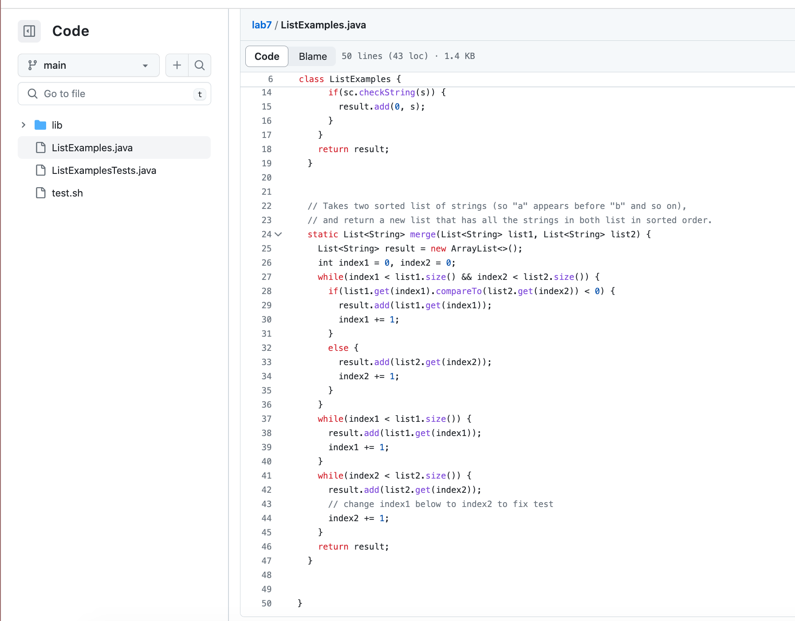

# Lab Report 4
In this lab report I am going to demonstrate and show the keys I pressed to make changes and update it to its Github repository all by commands in the terminal
## Step 4

**key pressed:** after typing in the command `ssh cil002@ieng6.ucsd.edu` to log into my ieng6 machine I pressed `<enter>` to ran it. 

## Step 5

**key pressed:** Then I typed `git clone` and `<tab> follow by `git@github.com:CibyL1226/lab7.git` I copied and pasted using `<ctrl + c> <ctrl + v>`, and I ran it using `<enter>`. After I cloned it. I used `ls` to make sure it was cloned to the repository. 

  
## Step 6

**key pressed:**

## Step 7

**key pressed:**

 

## Step 8

**key pressed:** 

  
## Step 9
**key pressed:**

 

## Result 

