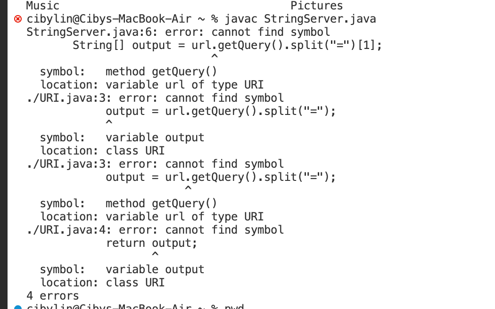
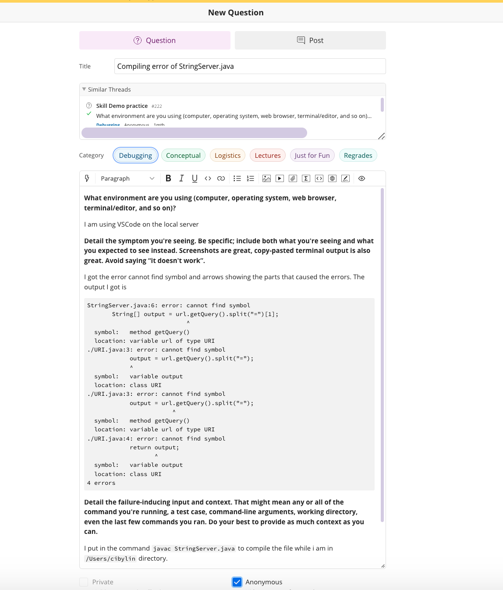
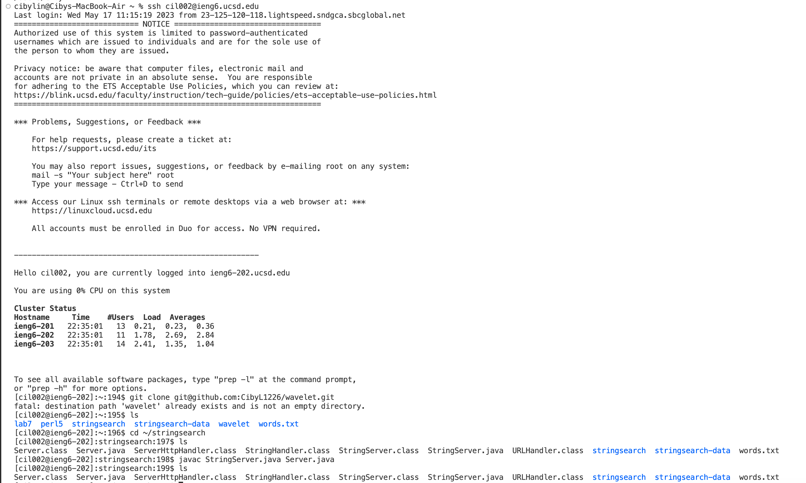

# Lab Report 5 #
## Part I - Debugging Scenario
This is an attempt to compile the StringServer.java file. 

Below is the command input and errors returned by the terminal:

Here is the EdStem message I used to asked a question to debug the error I am experiencing:

This is the TA response to the question above:

The TA response reminds the student to apply the steps they missed before compiling the file and now they have successfully got into the correcty directory and compile the `StringServer.java` and `Server.java` file.

The edits I did to fixed the bugs were to log into the local server with `ieng6` account and `cd` command into the `stringsearch` directory, then eventually run the command:`javac StringServer.java Server.java`.

## Part II - Reflection
